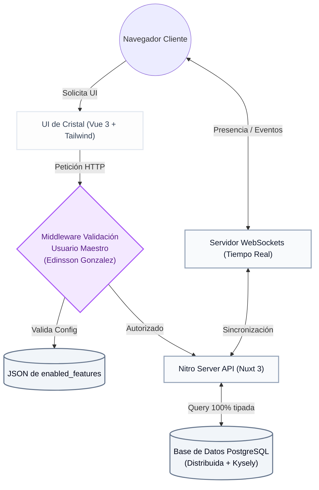
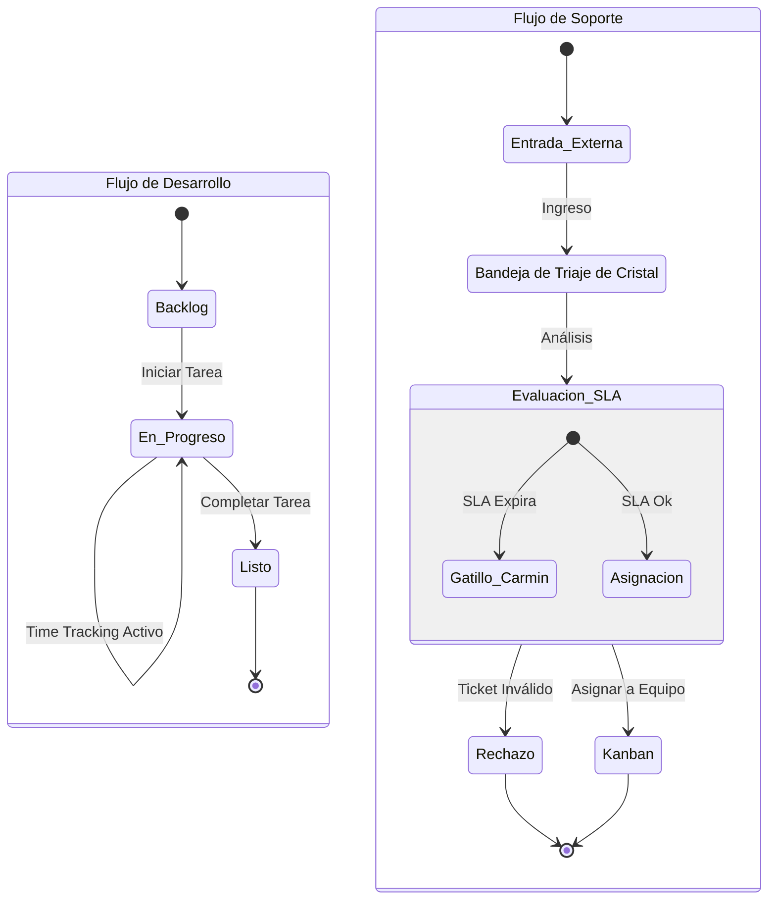
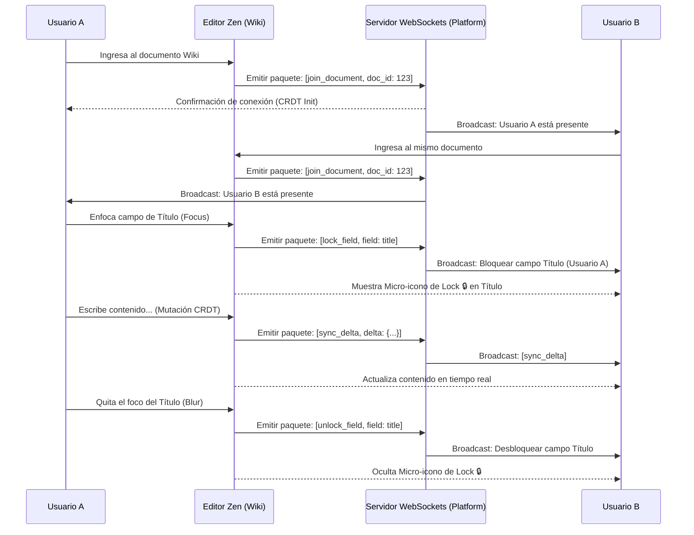

# 📄 Documentación Técnica Oficial - JIRA-REN

**Autor Principal:** Edinsson Gonzalez (Lead Software Architect & Developer)  
**Versión:** 1.0.0 (Enterprise Release)

Este documento detalla la estructura, decisiones arquitectónicas, base de datos y directrices técnicas implementadas en JIRA-REN, garantizando una base de conocimiento sólida para futuros escalamientos.

---

## 🏗 1. Arquitectura General del Ecosistema

JIRA-REN adopta una arquitectura de servidor desacoplado basada en **Nuxt 3**.

* **Frontend (Capa de Presentación):** Renderizado Híbrido (SSR + SPA) soportado por Vue 3. La interfaz está construida sobre TailwindCSS, con un enfoque estricto en el diseño **Light-Glassmorphism** y animaciones elásticas nativas e independientes del hilo principal (transform-gpu).
* **Backend (Capa de Lógica y API):** Desarrollado sobre **Nitro Engine** (incluido en Nuxt). Provee rutas API ultraligeras, seguras y de baja latencia.
* **Persistencia de Datos:** **PostgreSQL** manipulado a través de **Kysely**, un query builder 100% tipado en TypeScript.

---

## 🗄 2. Esquema de Base de Datos (PostgreSQL + Kysely)

El modelo relacional fue diseñado para soportar jerarquías corporativas complejas y flujos de trabajo ágiles simultáneos.

### Tablas Principales:
* `users`: Almacena identidad y credenciales. Contiene el flag maestro `is_master_admin` reservado para la gobernanza del sistema.
* `projects`: Entidad central. Posee un atributo JSONB `enabled_features` para el control modular (Feature Flags).
* `project_members`: Tabla pivote que gestiona la matriz de roles (`ADMIN`, `MEMBER`, `VIEWER`) por proyecto.
* `board_columns`: Estructura dinámica de las columnas del Kanban.
* `issues`: Los "Tickets" del sistema. Almacenan estado, estimaciones, sprint asignado, reportero y responsable.
* `sprints`: Gestor de ciclos ágiles, relaciona un periodo de tiempo con un conjunto de `issues`.
* `project_pages`: Jerarquía de documentos tipo Wiki (Árbol relacional) asociada a cada proyecto.
* `time_logs`: Registro cronológico de horas invertidas en cada tarea.
* `notifications`: Sistema de alertas en tiempo real (Menciones, Asignaciones, Cambios de Estado).

> *El esquema completo y tipado se encuentra en `server/database/types.ts` y las migraciones en `server/plugins/db-init.ts`.*

---

## 🧩 3. Estructura del Frontend (Client-Side)

La capa cliente en `client/` se estructura en módulos para maximizar la mantenibilidad:

* **`components/ui/`**: Componentes reutilizables con estética corporativa (Botones, Modales, CommandConsole flotante).
* **`layouts/`**: Plantillas maestras. `project.vue` maneja el Sidebar y el header unificado, validando si las pestañas están habilitadas vía *Feature Flags*.
* **`pages/`**: Rutas manejadas por el File-System Routing de Nuxt.
  * `projects/[id]/board`: Tablero Kanban con Drag & Drop optimizado.
  * `projects/[id]/backlog`: Vista de Planificación y gestión de Sprints.
  * `projects/[id]/reports`: Dashboards ejecutivos con curvas orgánicas en SVG (cero dependencias externas pesadas).
  * `projects/[id]/teams`: Matriz de roles y control de capacidad.
* **`composables/` y `store/`**: Gestión de estado global. El `useAuthStore` maneja de forma segura el ciclo de vida del usuario y sus roles.

---

## 🔌 4. API & Endpoints (Nitro Server)

Las rutas del servidor están alojadas bajo `server/api/` y responden en microsegundos:

* **Autenticación:** `/api/auth/login.post.ts`, `/api/auth/me.get.ts`
* **Proyectos:** `/api/projects/index.get.ts`, `/api/projects/[id]/index.get.ts`
* **Tablero (Kanban):** `/api/projects/[id]/issues/index.get.ts`, `/api/projects/[id]/columns/index.get.ts`
* **Sprints:** `/api/projects/[id]/sprints/index.get.ts`, `/api/projects/[id]/sprints/[sprint_id]/burndown.get.ts`
* **Documentación (Wiki):** `/api/projects/[id]/pages.get.ts`

Cada endpoint valida estrictamente el rol del usuario frente al proyecto solicitado para evitar escalada de privilegios.

---

## 🛡 5. Gobernanza y Feature Flags (Control Dinámico)

Para evitar la sobrecarga cognitiva de herramientas no utilizadas, el **Usuario Maestro** (SuperAdmin) administra el ecosistema a través del atributo JSON `enabled_features` en la tabla `projects`.

* **Estructura del Flag:**
    ```json
    {
      "kanban": true,
      "backlog": true,
      "docs": false,
      "teams": false,
      "reports": true,
      "support": false,
      "agile_views": true
    }
    ```
* **Implementación UI:** La interfaz oculta o muestra dinámicamente secciones del menú según estos flags y provee protección a nivel de middleware.

---

## ⚡ 6. UI/UX: Light-Glassmorphism a 60 FPS

Todo el diseño de JIRA-REN obedece a un sistema visual premium:
* **Materiales:** Fondos traslúcidos blancos y lavandas (`bg-white/40`, `bg-purple-500/10`) contrastados con bordes definidos (`border-white/60`) que replican cristal pulido.
* **Desempeño:** Para evitar el "Layout Thrashing" (cuellos de botella por CSS), el filtro `backdrop-blur-xl` siempre va acompañado de utilidades de aceleración por hardware (`transform-gpu`) para que la tarjeta gráfica asuma el cómputo y el scrolling se mantenga a 60 FPS fijos.
* **Interacciones:** Optimistic UI Updates. Las interfaces asumen la respuesta exitosa del servidor, mutando localmente la UI y sincronizándose en background, garantizando latencia cero para el usuario humano.

---

## ⌨️ 7. CommandConsole (La Terminal del Sistema)

Accesible mediante el atajo universal **`Shift + C`**, esta terminal flotante ofrece atajos a funciones profundas:
* Búsqueda centralizada (Indexa código de tickets, títulos de Wiki y nombres de usuario).
* Invocación rápida de módulos de la aplicación.
* Atajo secreto de estrés **`Ctrl + Shift + D`** para QA y Profiling Visual.

---

## 📁 8. Especificación de Arquitectura de Código (Documentos SRC)

La estructura del proyecto en Nuxt 3 / Nitro Server está meticulosamente organizada para mantener una separación de responsabilidades estricta. El código base consolida las lógicas canibalizadas de plane, platform y ever-teams.

### `client/modules/board/`
Responsable del flujo de trabajo ágil. Contiene la lógica del Kanban (Drag & Drop), la planificación de Sprints, visualización en diagramas de Gantt y Calendario corporativo. Está altamente optimizado para el renderizado de múltiples tarjetas a 60 FPS utilizando técnicas de virtualización y transformaciones GPU.

### `client/modules/wiki/`
Aloja el "Editor Zen", un entorno de documentación libre de distracciones. Implementa CRDT (Conflict-free Replicated Data Type) para garantizar la coherencia durante la edición concurrente y gestiona la capa de presencia multiusuario en tiempo real.

### `client/modules/support/`
Módulo dedicado a la atención al cliente interno/externo. Maneja la Bandeja de Triaje de Cristal, la gestión de tickets de Mesa de Ayuda y contiene el motor de cálculo y evaluación de SLA (Service Level Agreement), disparando alertas como el "Gatillo Carmín" ante posibles incumplimientos.

### `server/api/` y `server/middleware/`
Constituyen el corazón del Nitro Server. Aquí reside el "Control del Usuario Maestro" (Edinsson Gonzalez) mediante middlewares de validación de roles y permisos. Además, orquesta la inyección en caliente de Feature Flags, determinando qué módulos están disponibles para cada proyecto o usuario sin requerir reinicios del sistema.

---

## 📊 9. Diagramas de Arquitectura y Flujos (JIRA-REN)

### 9.1 Diagrama de Arquitectura General del Sistema



### 9.2 Ciclo de Vida: Tarea de Desarrollo vs Ticket de Soporte



### 9.3 Secuencia: Presencia en Tiempo Real (Editor Zen)



---
*Documento estructurado y emitido por el Arquitecto Principal del Ecosistema.*
