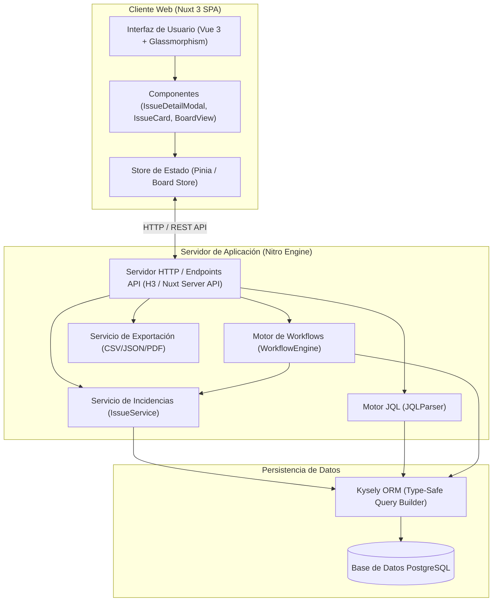
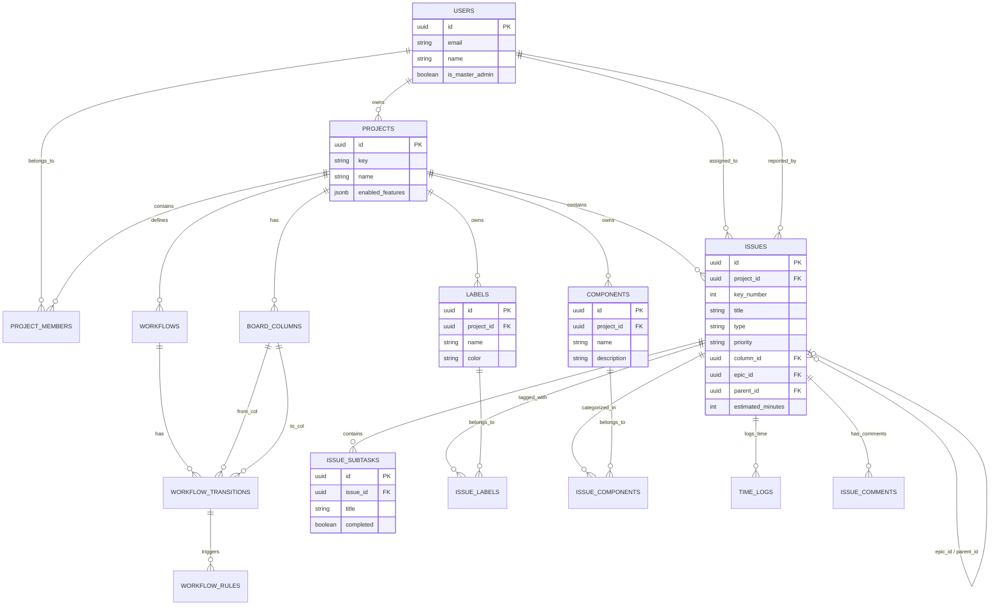
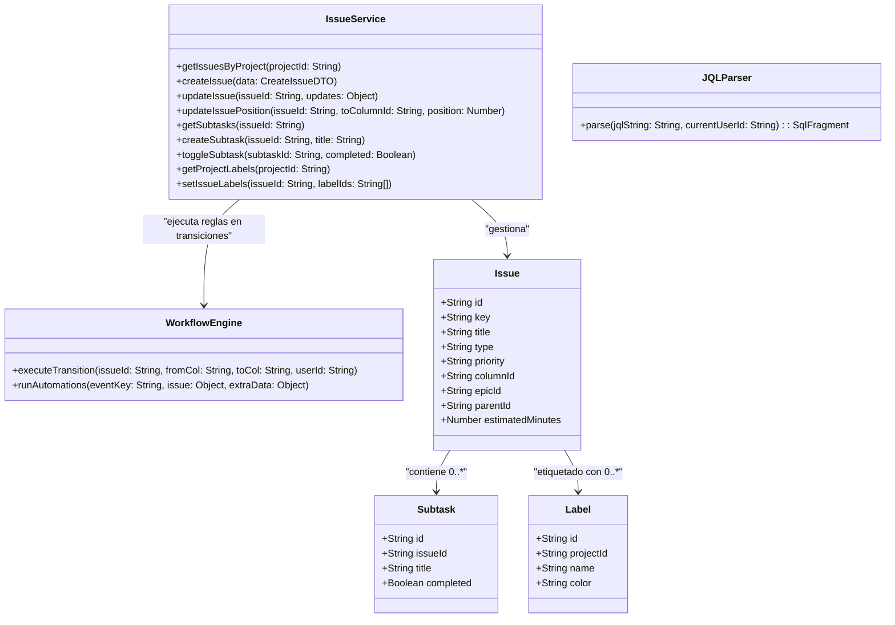
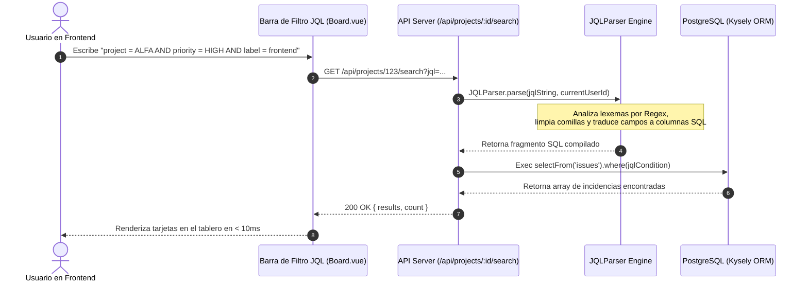
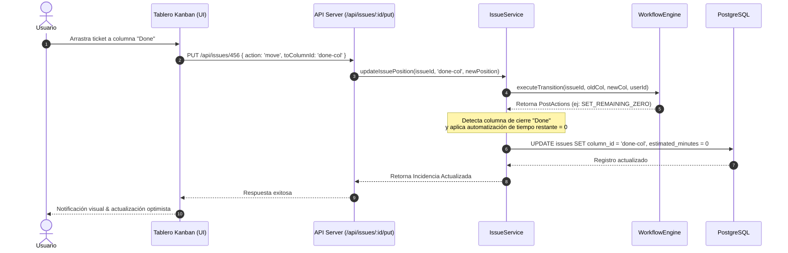
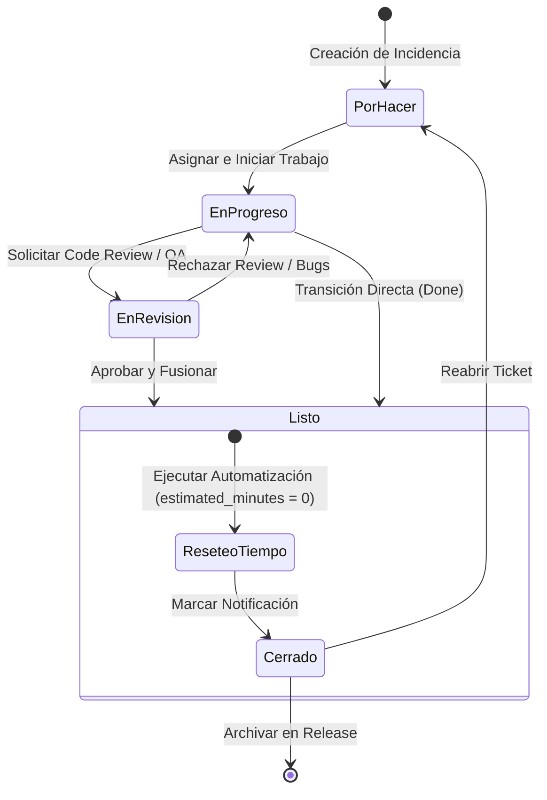
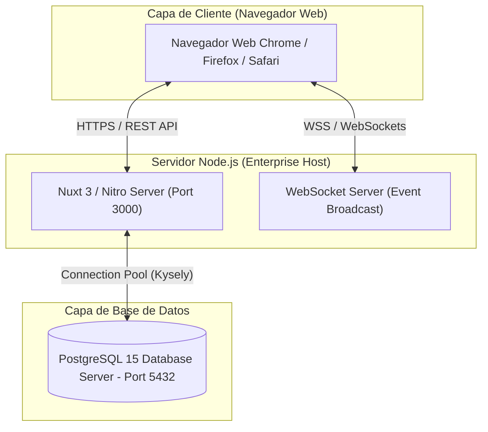
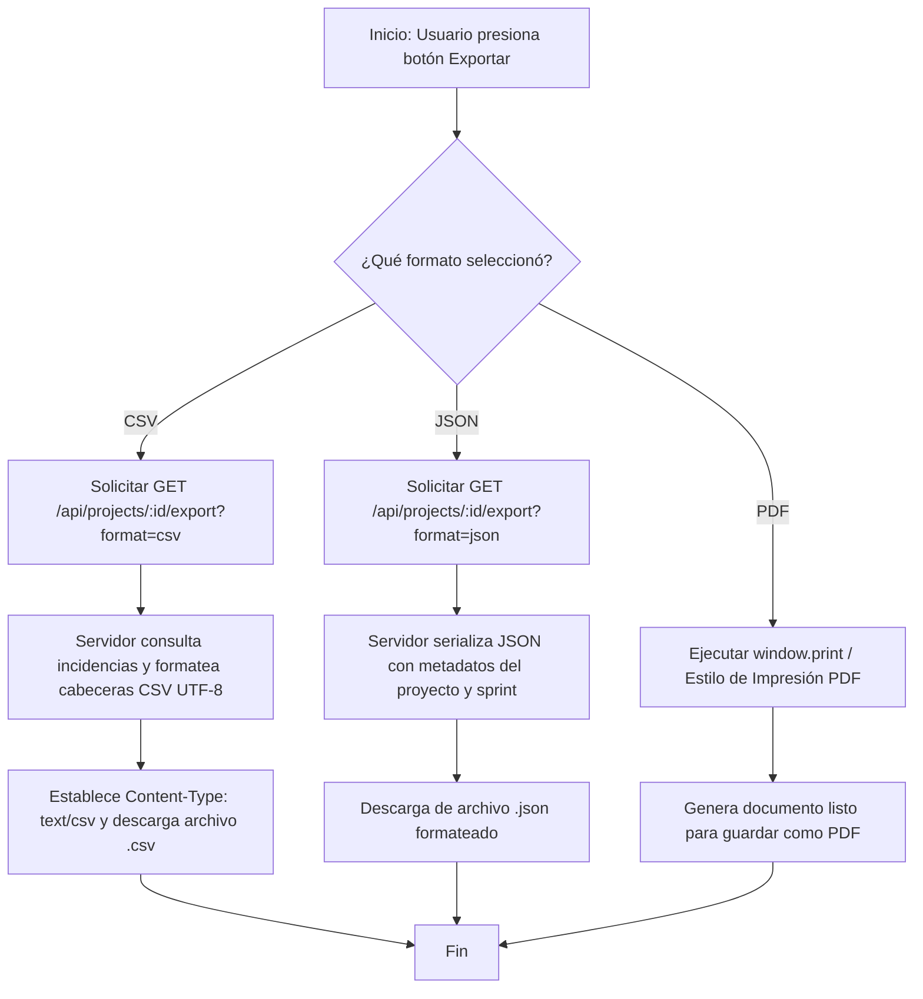

# Ecosistema UML & Arquitectura de Software - JIRA-REN

Documentación arquitectónica completa y especificación técnica visual del sistema **JIRA-REN**, elaborada mediante diagramas UML estandarizados en formato Mermaid.

---

## 📋 Índice de Diagramas UML

1. [Diagrama 1: Arquitectura General de Componentes (C4 Model)](#diagrama-1-arquitectura-general-de-componentes-c4-model)
2. [Diagrama 2: Modelo Entidad-Relación de la Base de Datos (ERD)](#diagrama-2-modelo-entidad-relación-de-la-base-de-datos-erd)
3. [Diagrama 3: Casos de Uso del Sistema (Use Case Diagram)](#diagrama-3-casos-de-uso-del-sistema-use-case-diagram)
4. [Diagrama 4: Diagrama de Clases del Dominio y Servicios (Class Diagram)](#diagrama-4-diagrama-de-clases-del-dominio-y-servicios-class-diagram)
5. [Diagrama 5: Secuencia - Procesamiento y Parseo de Consultas JQL](#diagrama-5-secuencia---procesamiento-y-parseo-de-consultas-jql)
6. [Diagrama 6: Secuencia - Transición de Estados y Automatizaciones](#diagrama-6-secuencia---transición-de-estados-y-automatizaciones)
7. [Diagrama 7: Máquina de Estados - Ciclo de Vida de una Incidencia](#diagrama-7-máquina-de-estados---ciclo-de-vida-de-una-incidencia)
8. [Diagrama 8: Diagrama de Despliegue e Infraestructura (Deployment Diagram)](#diagrama-8-diagrama-de-despliegue-e-infraestructura-deployment-diagram)
9. [Diagrama 9: Diagrama de Actividades - Exportación de Informes](#diagrama-9-diagrama-de-actividades---exportación-de-informes)

---

## Diagrama 1: Arquitectura General de Componentes (C4 Model)

Representación modular de la separación entre la capa de presentación SPA en Nuxt 3, el servidor de API en Nitro, el motor de persistencia Kysely/PostgreSQL y los servicios de automatización.



---

## Diagrama 2: Modelo Entidad-Relación de la Base de Datos (ERD)

Esquema de base de datos relacional PostgreSQL con soporte para jerarquía profunda de épicas, subtareas, workflows, automatizaciones, etiquetas y componentes.



---

## Diagrama 3: Casos de Uso del Sistema (Use Case Diagram)

Interacciones principales entre los actores del sistema (Usuario Miembro, Administrador de Proyecto y SuperAdmin) y las funcionalidades del software.

```mermaid
usecaseDiagram
    actor "Usuario / Miembro" as Member
    actor "Administrador de Proyecto" as ProjectAdmin
    actor "SuperAdmin (Master)" as SuperAdmin

    package "Sistema JIRA-REN" {
        usecase "Gestionar Incidencias & Subtareas" as UC_ManageIssues
        usecase "Vincular Épicas a Historias" as UC_LinkEpics
        usecase "Ejecutar Búsqueda Avanzada JQL" as UC_JQL
        usecase "Categorizar por Etiquetas y Componentes" as UC_Labels
        usecase "Exportar Reportes (CSV, JSON, PDF)" as UC_Export
        usecase "Configurar Flujos y Reglas de Automatización" as UC_Workflows
        usecase "Gobernanza & Inyección de Módulos (Feature Flags)" as UC_FeatureFlags
    }

    Member --> UC_ManageIssues
    Member --> UC_LinkEpics
    Member --> UC_JQL
    Member --> UC_Labels
    Member --> UC_Export

    ProjectAdmin --> UC_Workflows
    ProjectAdmin --> UC_ManageIssues
    ProjectAdmin --> UC_Export

    SuperAdmin --> UC_FeatureFlags
    SuperAdmin --> UC_Workflows
```

---

## Diagrama 4: Diagrama de Clases del Dominio y Servicios (Class Diagram)

Estructura orientada a objetos de los servicios backend y modelos de datos.



---

## Diagrama 5: Secuencia - Procesamiento y Parseo de Consultas JQL

Flujo paso a paso desde que el usuario introduce una consulta sintáctica JQL en la interfaz hasta la resolución en la base de datos PostgreSQL.



---

## Diagrama 6: Secuencia - Transición de Estados y Automatizaciones

Proceso de movimiento drag & drop de tarjetas, validación de reglas de workflow y ejecución automática del reseteo de tiempo restante a 0.



---

## Diagrama 7: Máquina de Estados - Ciclo de Vida de una Incidencia

Transiciones de estado permitidas en el ciclo de vida de un ticket dentro de JIRA-REN.



---

## Diagrama 8: Diagrama de Despliegue e Infraestructura (Deployment Diagram)

Topología de despliegue en entorno corporativo o cloud.



---

## Diagrama 9: Diagrama de Actividades - Exportación de Informes

Flujo de decisiones y procesamiento para exportar reportes de sprint en CSV, JSON o PDF.


